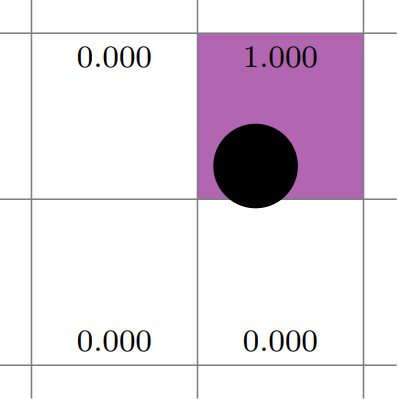
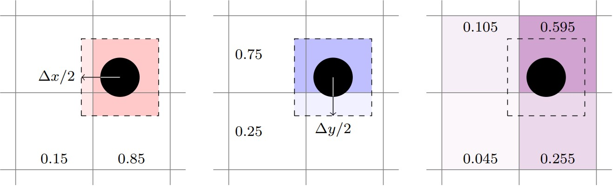
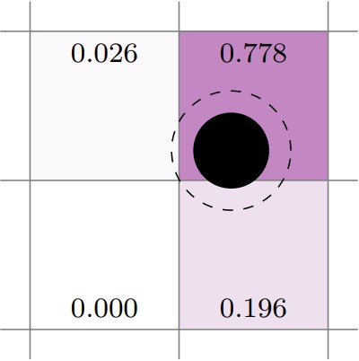
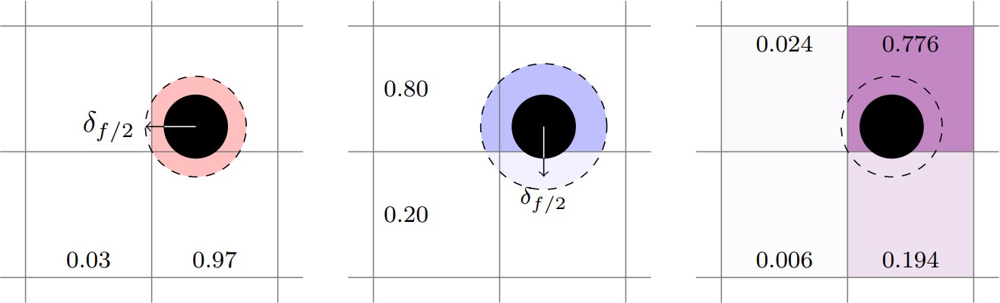

Interphase Coupling
===================

Deposition scheme
-----------------

The following inputs must be preceded by "mfix."

+----------------------------+---------------------------------------------------+--------+-------------+
|                            | Description                                       |   Type | Default     |
+============================+===================================================+========+=============+
| deposition_scheme          | The algorithm that will be used to deposit        | String | 'trilinear' |
|                            | particles quantities to the Eulerian grid         |        |             |
|                            | Available methods are:                            |        |             |
|                            |                                                   |        |             |
|                            | * 'centroid'                                      |        |             |
|                            | * 'trilinear'                                     |        |             |
|                            | * 'true-dpvm' divided particle volume method      |        |             |
|                            | * 'trilinear-dpvm-square' dpvm with square filter |        |             |
+----------------------------+---------------------------------------------------+--------+-------------+
| deposition_scale_factor    | The deposition scale factor. Only applies to      | Real   | 1.0         |
|                            | 'true-dpvm' and 'trilinear-dpvm-square' methods.  |        |             |
|                            | Its value must be in the interval [0, dx/2],      |        |             |
|                            | where dx is the cell edge size.                   |        |             |
+----------------------------+---------------------------------------------------+--------+-------------+
| deposition_diffusion_coeff | If a positive value is set, a diffusion equation  | Real   | -1.0        |
|                            | with this diffusion coefficient is solved to      |        |             |
|                            | smooth deposited quantities.                      |        |             |
+----------------------------+---------------------------------------------------+--------+-------------+

In the following subsections, the four possible deposition methods are briefly
described and illustrated.

Centroid
~~~~~~~~
In the centroid deposition scheme, particles' quantities are deposited only to
the Eulerian grid cell to which the particle's center belongs.

.. raw:: latex

   \begin{center}

   .. _fig:basics:amrgrids:

   Example of centroid deposition.

.. raw:: latex

   \end{center}

Trilinear
~~~~~~~~~
In the trilinear deposition scheme, particles' quantities are deposited linearly
to the eight Eulerian grid cells that surround its center.

.. raw:: latex

   \begin{center}

   .. _fig:basics:amrgrids:

   Example of trilinear deposition.

.. raw:: latex

   \end{center}

Divided Particle Volume Method (DPVM)
~~~~~~~~~~~~~~~~~~~~~~~~~~~~~~~~~~~~~
In the DPVM method, particles' quantities are deposited to the Eulerian grid
cells that they intersect, and the deposition weights are equal to the
percentage of the particle' volume that intersects the given cell.

.. raw:: latex

   \begin{center}

   .. _fig:basics:amrgrids:

   Example of dpvm deposition.

.. raw:: latex

   \end{center}

Square DPVM
~~~~~~~~~~~
In the square DPVM method, particles' quantities are deposited to the Eulerian
grid similarly to the DPVM method, but with a filter applied to the deposition
scheme.

.. raw:: latex

   \begin{center}

   .. _fig:basics:amrgrids:

   Example of square dpvm deposition.

.. raw:: latex

   \end{center}

Drag
----

The following inputs must be preceded by "mfix."

+-------------------+-----------------------------------------------------------------------+-------------+-----------+
|                   | Description                                                           |   Type      | Default   |
+===================+=======================================================================+=============+===========+
| drag_type         | Which drag model to use                                               | String      | None      |
+-------------------+-----------------------------------------------------------------------+-------------+-----------+

The options currently supported in mfix are :c++:`WenYu`, :c++:`Gidaspow`, :c++:`BVK2`, or :c++:`UserDrag`.

If one of these is not specified, the code will abort with

.. highlight:: c++

::

   amrex::Abort::0::"Don't know this drag type!!!

The drag models are defined in src/src_des/des_drag_K.H

If the user wishes to use their own drag model, they must

  * specify :c++:`mfix.drag_type = UserDrag` in the inputs file

  * provide the code in the ComputeDragUser routine in a local usr_drag.cpp file.
    An example can be found in tests/DEM06-x.

With the variables defined as follows:

   .. code:: shell

    /*
     *  \brief Returns: the calculated drag coefficient.
     *
     *  Inputs:
     *    EPg     - gas volume fraction
     *    Mug     - gas laminar viscosity
     *    ROpg    - gas density * EP_g
     *    vrel    - magnitude of gas-solids relative velocity
     *    DPM     - particle diameter of solids phase M
     *    DPA     - average particle diameter
     *    PHIS    - solids volume fraction of solids phases
     *    fvelx   - x component of the fluid velocity at the particle position
     *    fvely   - y component of the fluid velocity at the particle position
     *    fvelz   - z component of the fluid velocity at the particle position
     *    i, j, k - particle cell indices
     *    pid     - particle id number
     */

The WenYu model is defined as

   .. code:: shell

      RE = (Mug > 0.0) ? DPM*vrel*ROPg/Mug : DEMParams::large_number;

     if (RE <= 1000.0)
     {
         C_d = (24.0/(RE+DEMParams::small_number)) * (1.0 + 0.15*std::pow(RE, 0.687));
     }
     else
     {
         C_d = 0.44;
     }

     if (RE < DEMParams::eps) return 0.0;
     return 0.75 * C_d * vrel * ROPg * std::pow(EPg, -2.65) / DPM;

The Gidaspow model is defined as

   .. code:: shell

      ROg = ROPg / EPg;

      RE = (Mug > 0.0) ? DPM*vrel*ROPg/Mug : DEMParams::large_number;

      // Dense phase - EPg <= 0.8
      Ergun = 150.0*(1.0 - EPg)*Mug / (EPg*DPM*DPM) + 1.75*ROg*vrel/DPM;

      // Dilute phase - EPg > 0.8
      if (RE <= 1000.0)
      {
          C_d = (24.0/(RE+DEMParams::small_number)) * (1.0 + 0.15*std::pow(RE, 0.687));
      }
      else
      {
          C_d = 0.44;
      }

      WenYu = 0.75*C_d*vrel*ROPg*std::pow(EPg, -2.65) / DPM;

      // switch function
      PHI_gs = atan(150.0*1.75*(EPg - 0.8))/M_PI / DPM;

      // blend the models
      if (RE < DEMParams::eps) return 0.0;
      return (1.0 - PHI_gs)*Ergun + PHI_gs*WenYu;

The Gidaspow model is defined as

   .. code:: shell

      amrex::Real RE = (Mug > 0.0) ? DPA*vrel*ROPg/Mug : DEMParams::large_number;

      if (RE > DEMParams::eps)
      {
          oEPgfour = 1.0 / EPg / EPg / EPg / EPg;

          // eq(9) BVK J. fluid. Mech. 528, 2005
          // (this F_Stokes is /= of Koch_Hill by a factor of ep_g)
          F_Stokes = 18.0*Mug*EPg/DPM/DPM;

          F = 10.0*PHIS/EPg/EPg + EPg*EPg*(1.0 + 1.5*sqrt(PHIS));

          F += RE*(0.11*PHIS*(1.0+PHIS) - 4.56e-3*oEPgfour +
               std::pow(RE, -0.343)*(0.169*EPg + 6.44e-2*oEPgfour));

          // F += 0.413*RE/(24.0*EPg*EPg) *
          //     (1.0/EPg + 3.0*EPg*PHIS + 8.4/std::pow(RE, 0.343)) /
          //     (1.0 + std::pow(10.0, 3.0*PHIS)/std::pow(RE, 0.5 + 2.0*PHIS));

          return F*F_Stokes;
      }
      else
      {
          return 0.0;
      }

Heat Transfer Coefficient
-------------------------

The following inputs must be preceded by "mfix."

+-------------------+---------------------------------+-------------+--------------+
|                   | Description                     |   Type      | Default      |
+===================+=================================+=============+==============+
| convection_type   | Which HTC model to use          | String      | RanzMarshall |
+-------------------+---------------------------------+-------------+--------------+

The options currently supported in mfix are :c++:`RanzMarshall` (default) and :c++:`Gunn`. 
In both models the HTC is determined from a Nusslet number corelation. 

The RanzMarshall Nusselt number correlation is defined as: 

   .. code:: shell

      amrex::Real N_Nu = 2.0 + 0.6 * std::sqrt(N_Re) * std::pow(N_Pr, 0.333);

The Gunn Nusselt number correlation is defined as: 

   .. code:: shell

      amrex::Real N_Nu =
          (7 - 10*EPg + 5*EPg*EPg)*(1 + .7*std::pow(N_Re, 0.2)*std::cbrt(N_Pr))
          + (1.33 - 2.4*EPg + 1.2*EPg*EPg)*std::pow(N_Re, 0.7)*std::cbrt(N_Pr);

